# Cube Vision
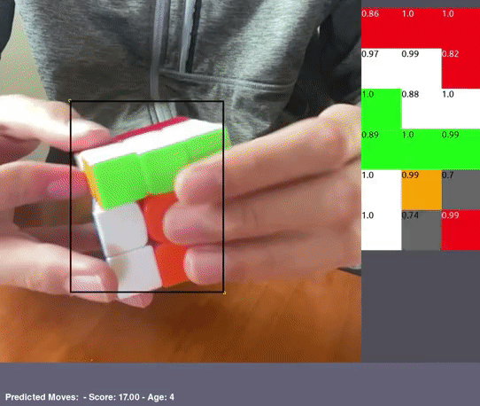

[Full Demo Video](CubeVisionDemo.mp4?raw=1)

## Goal
We all make mistakes. But when it comes to solving a Rubik’s cube very quickly, even the smallest mistakes add up very quickly. The problem is that reconstructing a solution, even with a video, is challenging and time consuming. As a result, common mistakes are identified slowly if at all. The goal of this project is to change that.

By tracking the moves made, it is possible to identify inefficient move algorithms, track how long different stages of the solve take, and reveal common mistakes. Software for such an application already exists, though these apps rely on “Smartcubes” - cubes with inbuilt computers to record moves. These cubes are expensive and heavy, making them impractical to practice with. 

With this project I aim to track moves using only computer vision.  I am building a mobile app that will give a scramble (an initial starting point for solving the cube), and then it will record a video of the solve in slow motion.  The app will then analyze the video frame by frame and determine each move that the cuber makes in a solve. 

## Object Detection
I focused on object detection on the first attempt, and used it for two purposes. First, a [single class object detection model](https://github.com/DamianOliver/cube-ssd/blob/main/training_configs/cube_crop_retinanet.yaml) is used to locate the cube in the image. The image is then cropped to that box; the resulting image is passed into a [second object detection model](https://github.com/DamianOliver/cube-ssd/blob/main/training_configs/cube_retinanet.yaml) which locates the pieces and identifies them with their respective colors.  

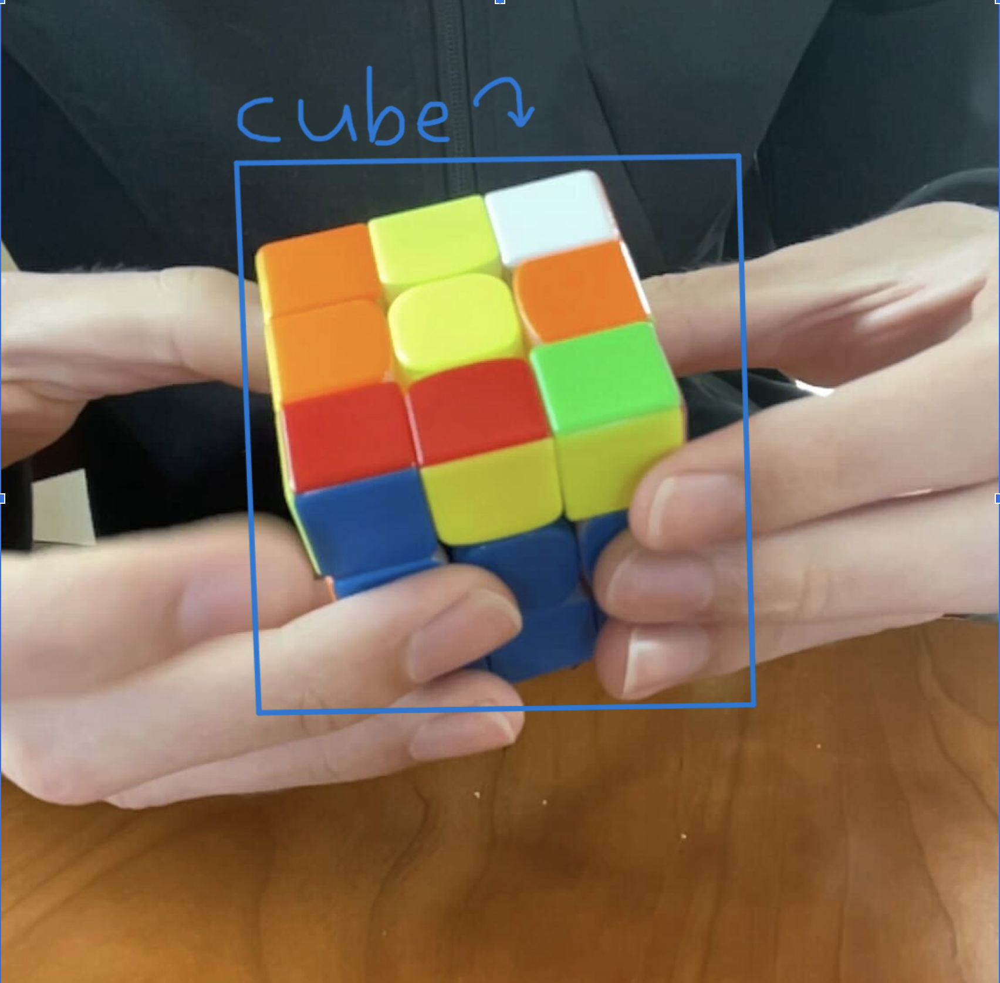 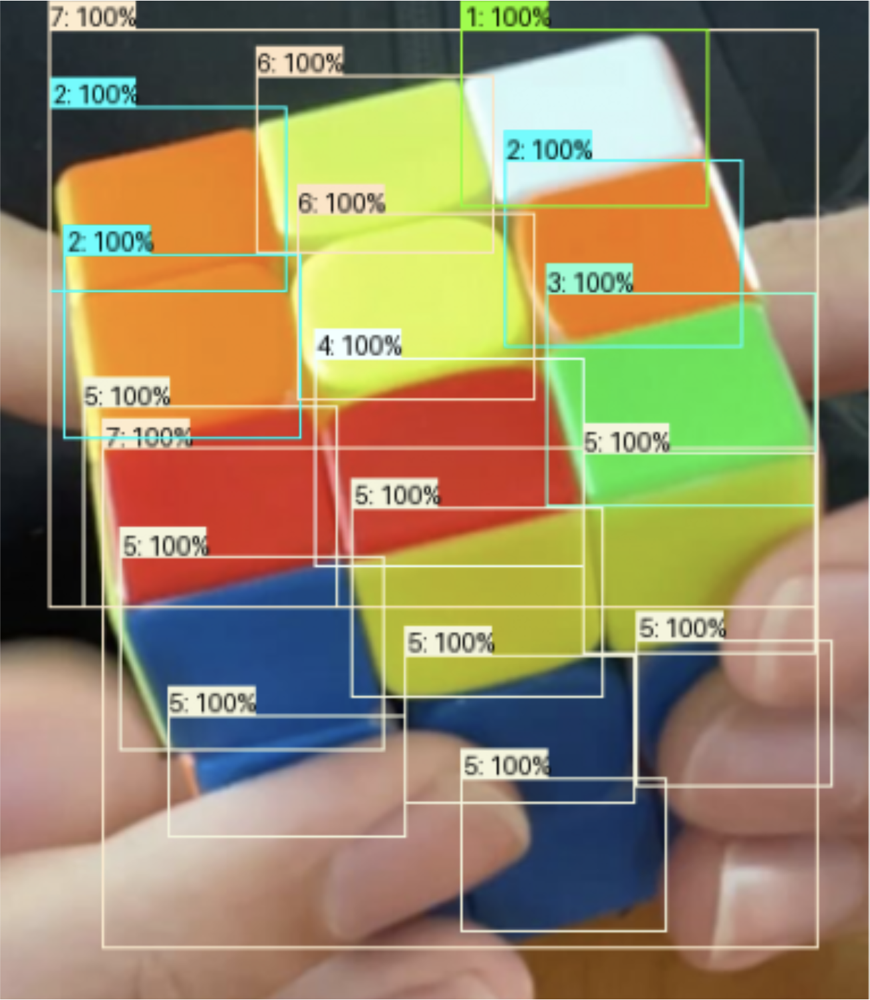

These boxes are then be passed into a simple heuristics algorithm that calculates which boxes correspond to which pieces. 

I use a Retinanet with a mobilenet backbone to achieve real time inference speeds, from the [tensorflow/models](https://github.com/DamianOliver/cube-tf-models) project.

## Data
Object detection models require vast quantities of data to train, ideally in the tens if not hundreds of thousands of annotated images. Sadly no university or tech giant has gotten around to making a large annotated database of Rubik’s cube images, and so I’m on my own. Rather than spending the next two years dragging boxes onto images of cubes, I decided to [create simulated data using Unity](https://github.com/DamianOliver/cube-unity/tree/main).

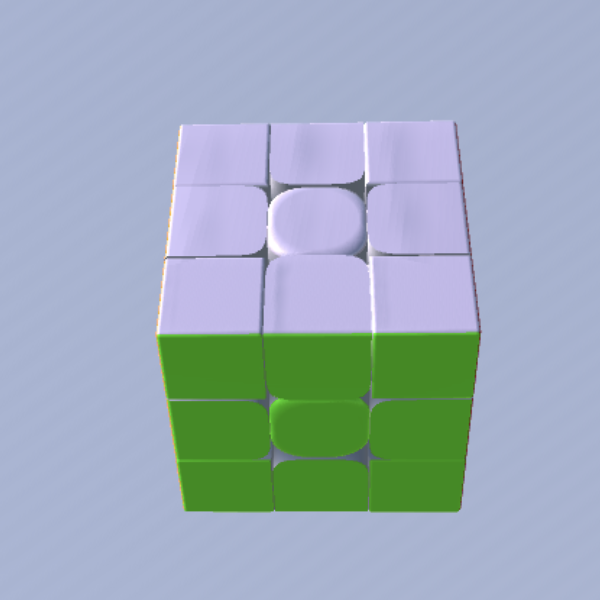  
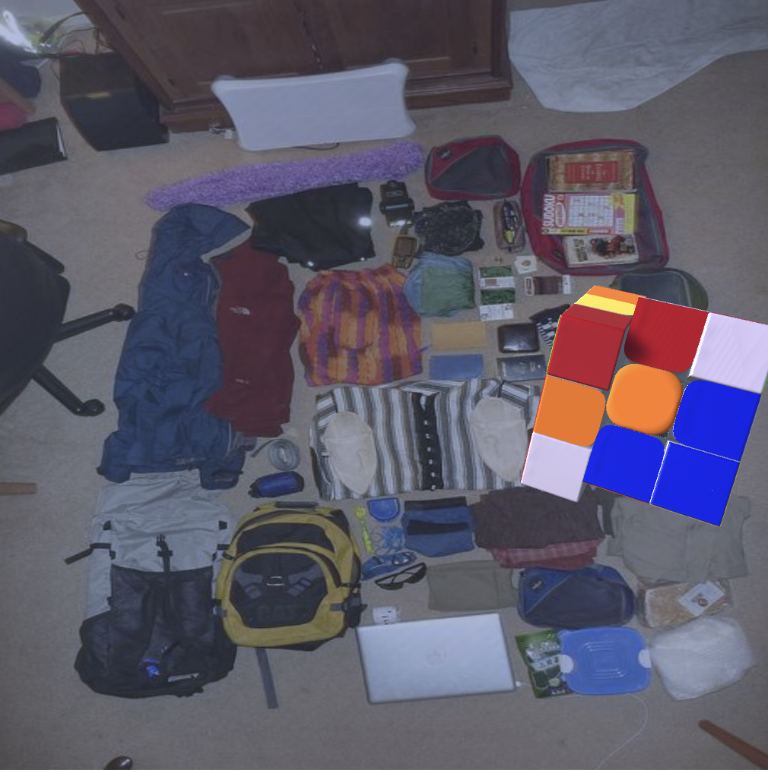 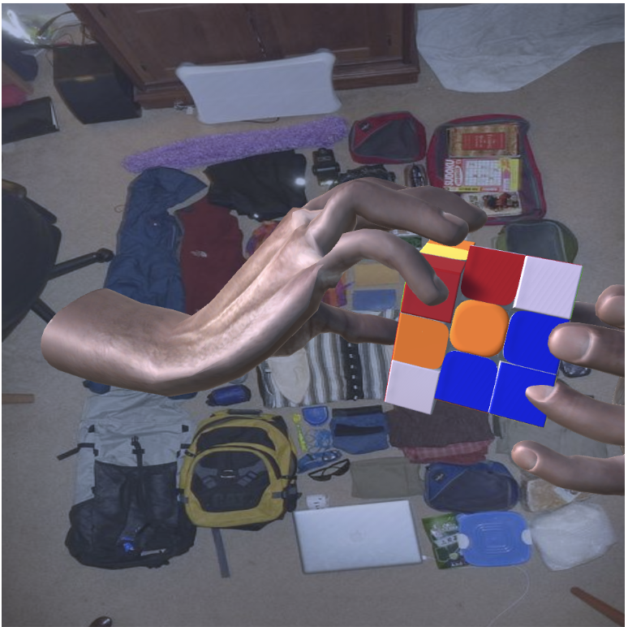 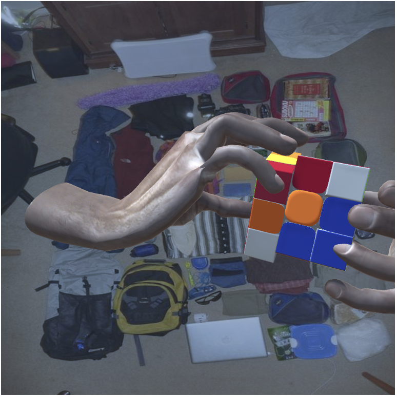

1. [Instantiate scene and cube object](https://github.com/DamianOliver/cube-unity/blob/main/Assets/Scripts/SetUp.cs)
1. [Randomize colors of pieces of cube](https://github.com/DamianOliver/cube-unity/blob/main/Assets/Scripts/GetState.cs)
1. Rotate one side of the cube, move the entire cube, rotate the entire cube
1. Apply a random background image from the coco dataset
1. [Match hands to position of cube, randomize angles of joints in hand](https://github.com/DamianOliver/cube-unity/blob/main/Assets/Scripts/PrintHand.cs)
1. [Randomize lighting location and color, shift RGB colors of pieces](https://github.com/DamianOliver/cube-unity/blob/main/Assets/Scripts/WeightColors.cs)

>[!Note]
> As this sample demonstrates, I am very good at Unity and so had no problems implementing this.
>
> 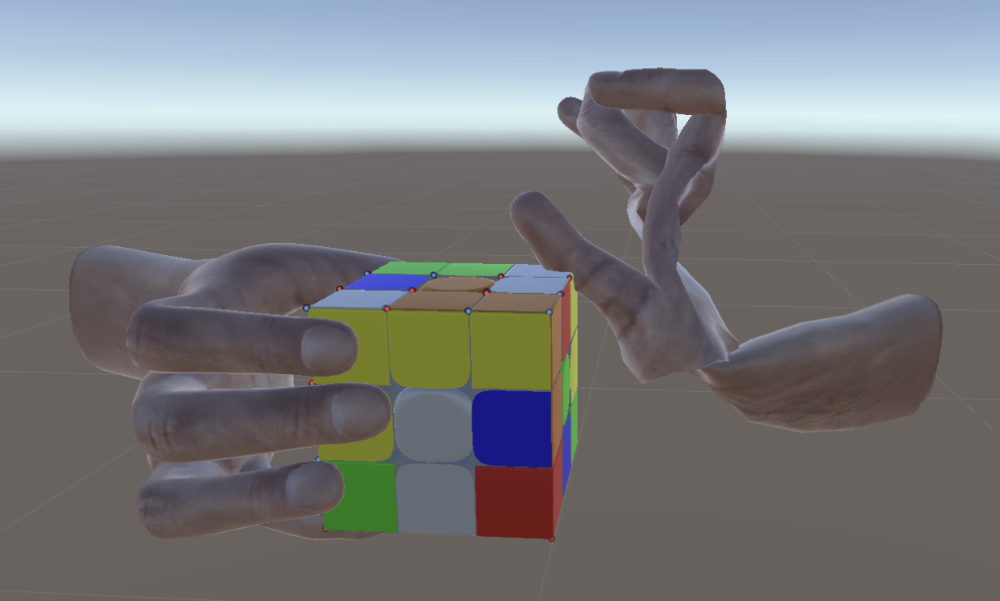

Once an image is generated and saved, a corresponding label file is also saved with the locations of all boxes in the image.

### Determining Visibility
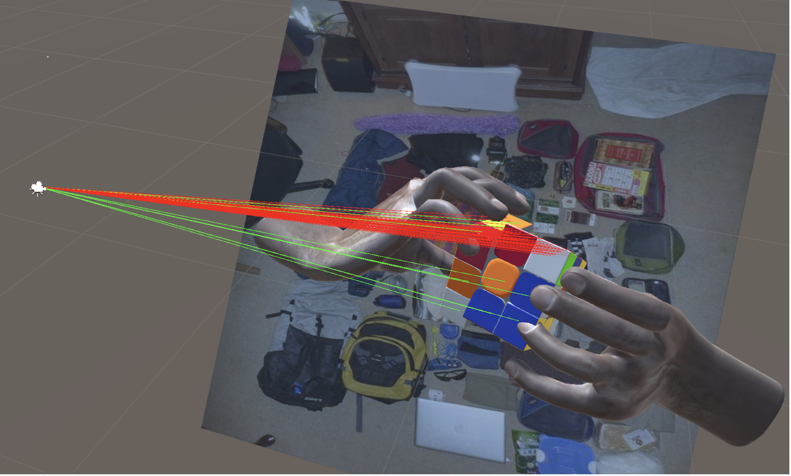 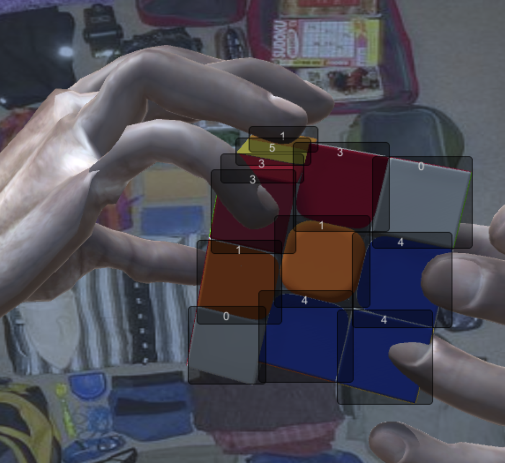

Only pieces which are actually visible should be given boxes. To determine visibility, a series of [rays are cast from the camera to individual pieces](https://github.com/DamianOliver/cube-unity/blob/main/Assets/Scripts/CheckVisible.cs). If all are blocked then the box is not saved. If a ray does make contact, the smallest box that fully covers the cube is recorded as well as the color of the sticker.

## Ordering the Boxes
Once the boxes are found, they need to be put into order. My first attempt toward solving this was to [use a series of heuristics.](https://github.com/DamianOliver/cube-models/blob/main/interpret.py#L145) Starting the highest box for instance, I would calculate a line to the next highest box. I would then calculate the distance of each box from this line. If any were close enough, these three pieces would be considered a row. I would then go to the next highest box and repeat the process. This worked…? Kind of?

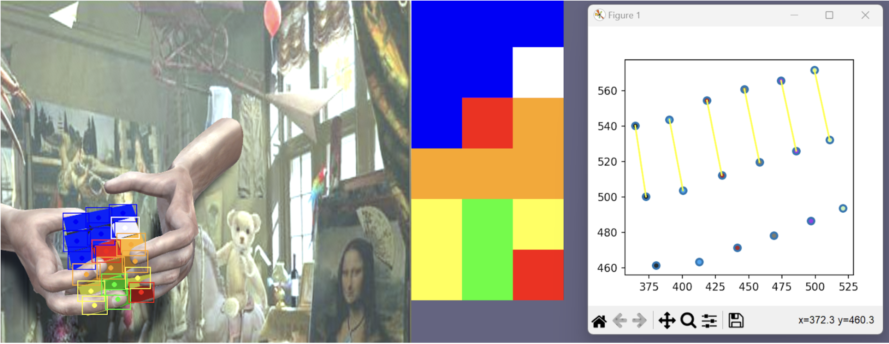
Lines between the first two points matched are shown.

### Too Many Edge Cases
This approach likely would have worked eventually. The problem was the many, many edge cases that needed to be accounted for. Additional code needed to be added for a turned left face, right face, top face, etc., etc., and that was assuming that all boxes were correct. One box in the wrong place could derail everything.

## Ordering the Boxes: Attempt 2

### Boxes -> Fully Connected Network 
Rather than hand code rules to order the boxes, it seemed a lot easier to use a machine learning approach. First, I tried a simple fully connected neural network, taking the centers of the top 20 predicted boxes as input. This worked somewhat, but overfitted easily and didn’t handle anomalous boxes well. 

### Simplified Image -> CNN
What worked better was converting the boxes into a simplified image. I formed a six channel image, one for each channel for each color. Each channel was set to 0 by default and 1 for pixels that fell within a box with color matching the channel. 

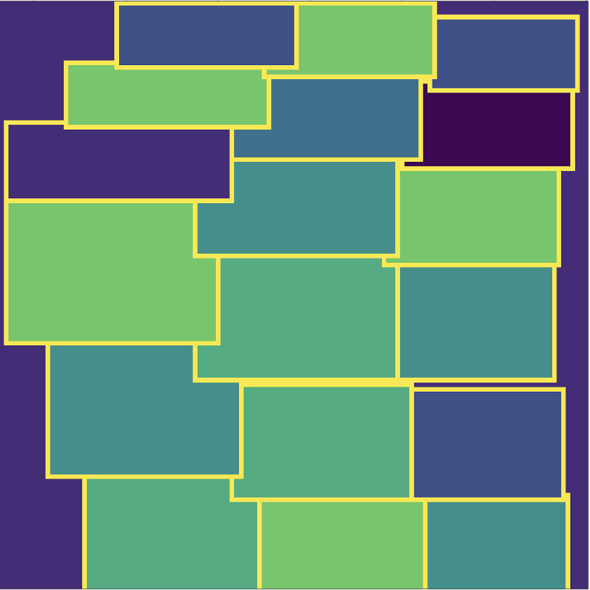

This simplified image was then passed into a [simple CNN with 18 classification heads](https://github.com/DamianOliver/cube-models/blob/main/deep_interpret.py), one for each piece on the front two faces. To create the training data I used the labels for simulated images and added or removed a box or two at random. For loss I simply used logistic cross entropy summed over every output.

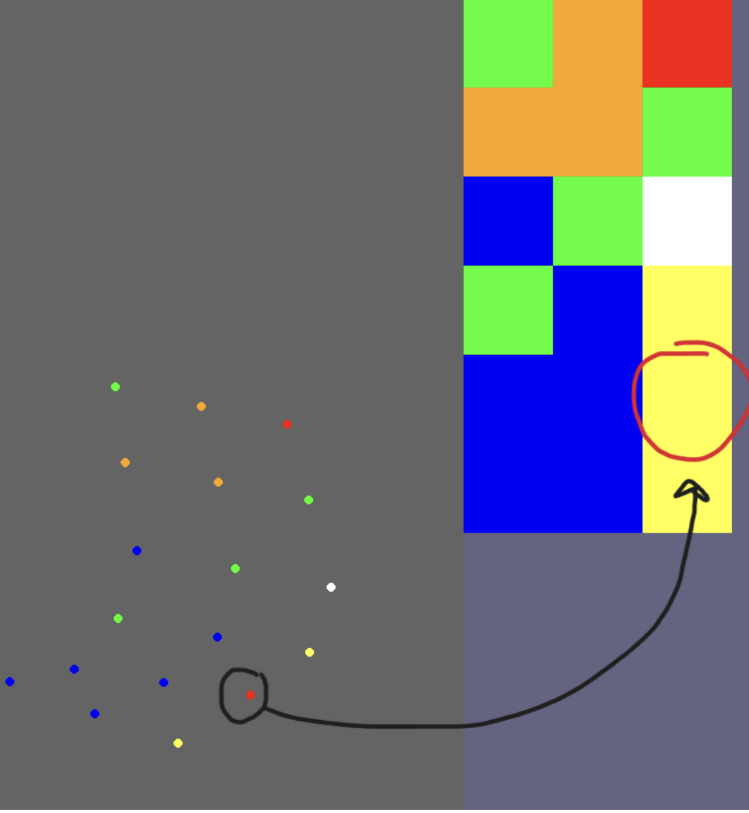

This method of ordering boxes works fairly well, with only minor mistakes, such as missing the red piece above.

### There’s Probably A Better Way
While this system of reading the cube, using a CNN to interpret the results of an object detection network was passable, it really seemed overcomplicated. Bounding boxes are a great way for humans to understand where things are in an image, but for a neural network a multi dimensional feature vector gets the idea across a lot better. I decided to streamline the process, removing the retinanet heads and directly connecting my mobilenet backbone to the 18 convolutional classification heads (I did test other output mechanisms but having a lot of heads worked best for whatever reason). I decided to continue using the first object detection model, cropping the image to the cube, as this did significantly improve accuracy. This simplified inference pipeline improved both accuracy and inference time.

## Search Algorithm
A glaring flaw with the approach thus far is that it only accounts for single frames, while identifying moves clearly requires more than one frame. While a computer vision model with video input would likely perform better, such a model would require greater resources to train and would make simulating data much more challenging. Instead, a search algorithm is used to find the most plausible set of moves performed over a sequence of frames based on the series of states given by the vision model.

While the vision model is correct more often than not, it is still prone to many mistakes, meaning that any search algorithm must be robust to inaccurate data. Further, as the vision model only accounts for two sides of the cube (and at times only one side is visible), some moves may not visibly change the state of the cube at all, meaning that even when not considering the impact of mistakes, it may still be necessary to find a state two or more moves away.

The algorithm stores a set of n possible move sequences. On each frame each sequence is expanded by k moves (2 generally works well). For n = 10 and k = 2 this results in 10 * 20 possible moves^2 = 4000 states to consider on each frame. The algorithm ranks each state based on several criteria. First, the number of stickers in the state that match the stickers returned by the vision algorithm. Each state is associated with an age, the number of frames since that state was first reached. As turning at one move per frame is not possible (probably), a penalty is applied to any state which is derived from a previous state less than 5 frames old. This is important as it prevents the search algorithm from following erroneous results from the vision model, forcing it instead to find states which are generally correct for several frames. A small additional penalty is applied to states which are reached at a higher depth. To further increase robustness, the score of each state is defined as the average of its score and its parent’s score. This further reduces the likelihood that an incorrect series of moves that eventually leads to a correct looking position (from the sides visible) will be accepted.

States that represent the same position but were arrived at by different moves are removed. Once all states have been scored, all but the top n are discarded.

Additional optimizations, such as not distinguishing between red and orange when counting the number of matching stickers (as the vision model commonly confuses these two), or expanding the search to a higher depth when no good states are found also yield improvements to accuracy.
