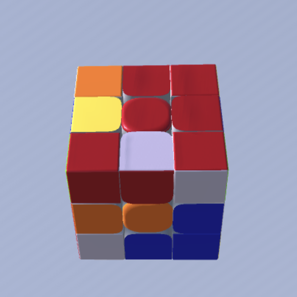
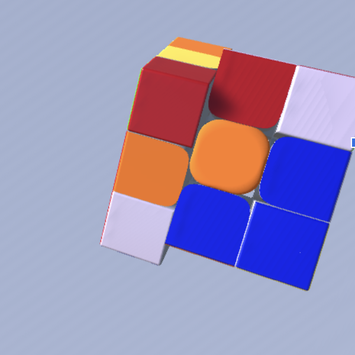

# Cube Vision

## Goal
We all make mistakes. But when it comes to solving a Rubik’s cube very quickly, even the smallest mistakes add up very quickly. The problem is that reconstructing a solution, even with a video, is challenging and time consuming. As a result, common mistakes are identified slowly if at all. The goal of this project is to change that.

By tracking the moves made, it is possible to identify inefficient move algorithms, track how long different stages of the solve take, and reveal common mistakes. Software for such an application already exists, though these apps rely on “Smartcubes” - cubes with inbuilt computers to record moves. These cubes are expensive and heavy, making them impractical to practice with. This project aims to instead track moves using computer vision.

## Object Detection
On the first attempt, object detection served two purposes. First, a single class object detection model is used to locate the cube in the image. The image is then cropped to that box; the resulting image is passed into a second object detection model which locates the pieces and identifies them with their respective colors.

 

These boxes will then be passed into a simple heuristics algorithm which will calculate which boxes correspond to which pieces. The object detection model used is Retinanet with a mobilenet backbone to achieve real time inference speeds.

## Data
Object detection models require vast quantities of data to train, ideally in the tens if not hundreds of thousands of annotated images. Sadly no university or tech giant has gotten around to making a large annotated database of Rubik’s cube images, and so I’m on my own. Rather than spending the next two years dragging boxes onto images of cubes, I decided to create simulated data using Unity.

  
  

1. Instantiate scene and cube object
1. Randomize colors of pieces of cube
1. Rotate one side of the cube, move the entire cube, rotate the entire cube
1. Apply a random background image from the coco dataset
1. Match hands to position of cube, randomize angles of joints in hand
1. Randomize lighting location and color, shift RGB colors of pieces

As this sample demonstrates, I am very good at Unity and so had no problems implementing this.

 

Once an image is generated and saved, a corresponding label file is also saved with the locations of all boxes in the image. Only pieces which are actually visible should be given boxes. To determine visibility, a series of rays are cast from the camera to individual pieces. If all are blocked then the box is not saved. If a ray does make contact, the smallest box that fully covers the cube is recorded as well as the color of the sticker.

## Ordering the Boxes
Once the boxes are found, they need to be put into order. My first attempt toward solving this was to use a series of heuristics. Starting the highest box for instance, I would calculate a line to the next highest box. I would then calculate the distance of each box from this line. If any were close enough, these three pieces would be considered a row. I would then go to the next highest box and repeat the process. This worked…? Kind of?

Lines between the first two points matched are shown.

This approach likely would have worked eventually. The problem was the many, many edge cases that needed to be accounted for. Additional code needed to be added for a turned left face, right face, top face, etc., etc., and that was assuming that all boxes were correct. One box in the wrong place could derail everything.

## Ordering the Boxes: Attempt 2
Rather than hand code rules to order the boxes, it seemed a lot easier to use a machine learning approach. First, I tried a simple fully connected neural network, taking the centers of the top 20 predicted boxes as input. This worked somewhat, but overfitted easily and didn’t handle anomalous boxes well. What worked better was converting the boxes into a simplified image. I formed a six channel image, one for each channel for each color. Each channel was set to 0 by default and 1 for pixels that fell within a box with color matching the channel. 

Example Box-Only Image

This simplified image was then passed into a simple CNN with 18 classification heads, one for each piece on the front two faces. To create the training data I used the labels for simulated images and added or removed a box or two at random. For loss I simply used logistic cross entropy summed over every output.
